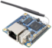
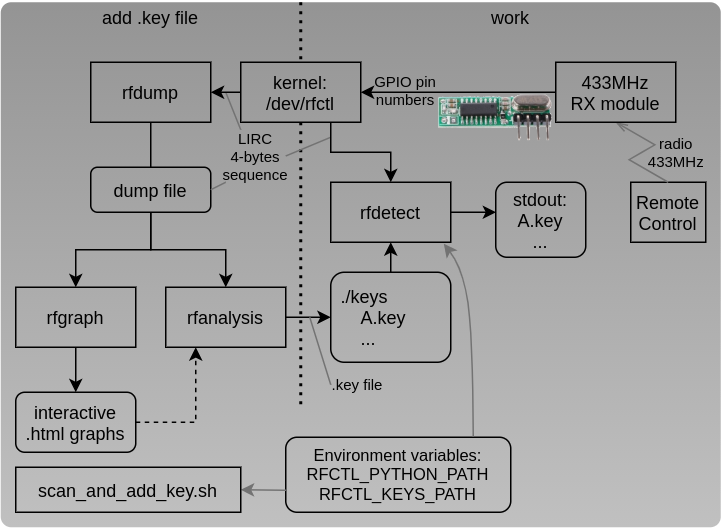
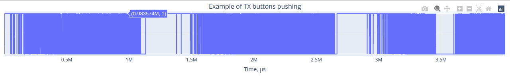
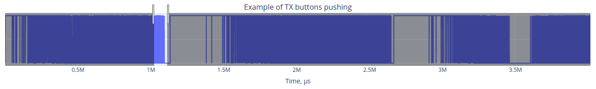
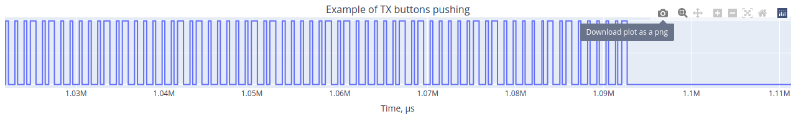

433.92 MHz RF communication on Linux
===========================================
[![License Badge][]][License] [![Travis Status][]][Travis]

[rfctl][] is a simple Linux driver and control tool for 433.92 MHz RF
communication on Raspberry Pi.

The following guide assumes the Raspbian Linux distribution is used on
the Raspberry Pi.  However, the kernel driver and the `rfctl` tool
should work fine on any distribution with a relatively modern kernel.

The following formum topic, although dated, also covers this driver and
provides some helpful tips and discussions.

- https://www.raspberrypi.org/forums/viewtopic.php?t=11159


# rfctl driver

The default control interface of the `rfctl` tool utilizes `rfctl.ko`.
It is a LIRC style kernel device driver transmitting and recording pulse
and pause lengths by bit banging on a GPIO pin.  See [HARDWARE.md][] for
information on how to connect the GPIO to a common 433 MHz TX module.

## buld

To build you first need to install the kernel headers.

 For **Raspbian** the `raspberrypi-kernel-headers` meta package points to the latest kernel
headers, which will install somewhere in `/lib/modules`:

```sh
sudo apt install raspberrypi-kernel-headers
```

 For **Orange Pi Armbian**:
```sh
sudo apt install linux-headers-current-sunxi
```
Or use armbian-config curses menu tool:
```sh
sudo armbian-config
```

## install

Then enter the kernel driver directory to build, load the driver, and
create the device node `rfctl` uses:

```sh
cd rfctl/kernel
make
sudo make insmod
```

Example of kernel module load with parameters for Orange PI Zero:
```sh
insmod rfctl.ko gpio_out_pin=6 gpio_in_pin=7
```

## check

Check for kernel loaded modules:
```sh
lsmod|grep rfctl
rfctl                  49152  0
```

Check kernel log:
```sh
dmesg|grep rfctl
```

Check GPIO pins status by [WiringPi](http://wiringpi.com/).

For example, on Orange PI Zero (see 6 & 7 in GPIO column):
```sh
root@orangepizero:/home/1/wiringOP-master/gpio/gpio readall
 +------+-----+----------+------+---+  OPi H2  +---+------+----------+-----+------+
 | GPIO | wPi |   Name   | Mode | V | Physical | V | Mode | Name     | wPi | GPIO |
 +------+-----+----------+------+---+----++----+---+------+----------+-----+------+
 |      |     |     3.3V |      |   |  1 || 2  |   |      | 5V       |     |      |
 |   12 |   0 |    SDA.0 |  OFF | 0 |  3 || 4  |   |      | 5V       |     |      |
 |   11 |   1 |    SCL.0 |  OFF | 0 |  5 || 6  |   |      | GND      |     |      |
 |    6 |   2 |      PA6 |  OUT | 0 |  7 || 8  | 0 | OFF  | TXD.1    | 3   | 198  |
 |      |     |      GND |      |   |  9 || 10 | 0 | OFF  | RXD.1    | 4   | 199  |
 |    1 |   5 |    RXD.2 |  OFF | 0 | 11 || 12 | 0 | IN   | PA07     | 6   | 7    |
 |    0 |   7 |    TXD.2 |  OFF | 0 | 13 || 14 |   |      | GND      |     |      |
 |    3 |   8 |    CTS.2 |  OFF | 0 | 15 || 16 | 0 | OFF  | SDA.1    | 9   | 19   |
 |      |     |     3.3V |      |   | 17 || 18 | 0 | OFF  | SCK.1    | 10  | 18   |
 |   15 |  11 |   MOSI.1 |  OFF | 0 | 19 || 20 |   |      | GND      |     |      |
 |   16 |  12 |   MISO.1 |  OFF | 0 | 21 || 22 | 0 | OFF  | RTS.2    | 13  | 2    |
 |   14 |  14 |   SCLK.1 |  OFF | 0 | 23 || 24 | 0 | OFF  | CE.1     | 15  | 13   |
 |      |     |      GND |      |   | 25 || 26 | 0 | OFF  | PA10     | 16  | 10   |
 +------+-----+----------+------+---+----++----+---+------+----------+-----+------+
 | GPIO | wPi |   Name   | Mode | V | Physical | V | Mode | Name     | wPi | GPIO |
 +------+-----+----------+------+---+  OPi H2  +---+------+----------+-----+------+
```


# rfctl tool

`rfctl` is a small tool that acts as a remote control for switches that
use simple unidirectional communication based on OOK (On Off Keying)
modulation on a 433 MHz carrier.  By default `rfctl` uses the Linux
`rfctl.ko` kernel driver.

To build:

```sh
cd rfctl/src
make
sudo make install
```

A simple test on an old style (not selflearning) NEXA/PROVE/ARC set to
group D, channel 1.

```sh
rfctl -p NEXA -g D -c 1 -l 1
rfctl -p NEXA -g D -c 1 -l 0
```

Some popular (cheap) noname RF sockets, available from e.g. Conrad (DE),
Kjell & C:o (SE), or Maplin (UK) use the SARTANO/ELRO protocol and need
to be encoded like this:

```sh
rfctl -p SARTANO -c 1000100000 -l 1     # I - 1
rfctl -p SARTANO -c 1000010000 -l 1     # I - 2
rfctl -p SARTANO -c 1000001000 -l 1     # I - 3
rfctl -p SARTANO -c 1000000100 -l 1     # I - 4

rfctl -p SARTANO -c 0100100000 -l 1     # II - 1
rfctl -p SARTANO -c 0100010000 -l 1     # II - 2
rfctl -p SARTANO -c 0100001000 -l 1     # II - 3
rfctl -p SARTANO -c 0100000100 -l 1     # II - 4

rfctl -p SARTANO -c 0010100000 -l 1     # III - 1
rfctl -p SARTANO -c 0010010000 -l 1     # III - 2
rfctl -p SARTANO -c 0010001000 -l 1     # III - 3
rfctl -p SARTANO -c 0010000100 -l 1     # III - 4

rfctl -p SARTANO -c 0001100000 -l 1     # IV - 1
rfctl -p SARTANO -c 0001010000 -l 1     # IV - 2
rfctl -p SARTANO -c 0001001000 -l 1     # IV - 3
rfctl -p SARTANO -c 0001000100 -l 1     # IV - 4
```

Issue `rfctl --help` to get more information on supported protocols and
options.

**Note:** All protocols might not be fully tested due to lack of
receivers and time :)


# python utilities

### **Workflow:**



### **rfdump**

```sh
python3 rfdump.py -h

Dumps from device file by 4 bytes LIRC sequence.

Usage: python3 rfdump.py -v -t <seconds> <device>
        -v          verbose, dump hex values by 4 bytes
        -V          as -v but dump to both: stdout (binary) & stderr (hex)
        <seconds>   dump time; default: forever; example: -t 0.5
        <device>    path to device; default: /dev/rfctl

Examples:
        rfdump.py > rfdump.bin
        rfdump.py -V -t .1 > rfdump.bin
```

Example usage with `-V` option:
```sh
python3 rfdump.py -V -t 0.1 > rfdump.bin
Open device file /dev/rfctl
Read from device for 0.1 seconds
d0030001
94000000
9a020001
95000000
06060001
e1000000
af710001
6e000000
d5a80001
ad000000
ef270001
94000000
3f100001
58000000

xxd rfdump.bin 
00000000: d003 0001 9400 0000 9a02 0001 9500 0000  ................
00000010: 0606 0001 e100 0000 af71 0001 6e00 0000  .........q..n...
00000020: d5a8 0001 ad00 0000 ef27 0001 9400 0000  .........'......
00000030: 3f10 0001 5800 0000                      ?...X...
```

### **rfgraph**

```sh
python rfgraph.py -h
usage: rfgraph.py [-h] [-t GRAPH_TITLE] [-s START_TIME] [-e END_TIME] BIN_DUMP_FILE_PATH

Rfdump graph tool. Makes interactive graph (based on plotly https://plotly.com/python/line-charts/) from binary dump file.

positional arguments:
  BIN_DUMP_FILE_PATH  Binary dump file; example: "rfdump.bin"

optional arguments:
  -h, --help          show this help message and exit
  -t GRAPH_TITLE      By default is file name
  -s START_TIME       Filter by time: start time, µs; example: "-s 2_220_000"
  -e END_TIME         Filter by time: end time, µs; example: "-e 2_270_000"

Example: python3 rfgraph.py -t "Example of TX buttons pushing" rfdump.bin > example.htm
```
Examples of interactive html file of 4 seconds rfctl dump.

Full graph with mouse popup:


Select range by mouse to zoom in:


Current view can be saved to picture:



### **rfanalysis**

```sh
python rfanalysis.py -h
usage: rfanalysis.py [-h] [-l SAMPLE_LEN] [-d] [-D] [-s START_TIME] [-e END_TIME] BIN_DUMP_FILE_PATH

Rfdump analysis tool. Helps coding schemes snalysis from binary dump file.

positional arguments:
  BIN_DUMP_FILE_PATH  Dump binary file or stdin; exmple: "rfdump.bin" or "-"

optional arguments:
  -h, --help          show this help message and exit
  -l SAMPLE_LEN       Sample length; default: 15
  -b                  Dump LIRC samples as binary
  -d                  Just dump LIRC samples with time line stamps
  -D                  As -d but dump also a hex values
  -s START_TIME       Filter by time: start time, µs; example: "-s 2_220_000"
  -e END_TIME         Filter by time: end time, µs; example: "-e 2_270_000"
```

### **rfdetect**

```sh
python3 rfdetect.py -h

Detect from device or binary dump file. Detection patterns read from .key files. Key file is space separated values text table; row is level & time (according LIRC dumps).

Usage: python3 rfdetect.py -v -k <path to .key files>
        -v                     verbose
        <path to .key files>   default: "./keys"
        <device>               path to device or stdin "-"; default: /dev/rfctl

Examples:
        python3 rfdetect.py
        cat rfdump.bin | python3 rfdetect.py -v -
```

Example with key detection and pushing "A" button on 433MHz Remote Control Transmitter:
```sh
python3 rfdetect.py
A.key
A.key
A.key
```

Example of A.key file:
```sh
cat ./keys/A.key
000_467 1 00_710
001_177 0 00_678
001_855 1 00_346
002_201 0 00_704
002_905 1 00_342
003_247 0 00_712
003_959 1 00_335
004_294 0 00_710
```


# there are four lights

As an example of how to automate your home, there is a small script
included that can be set up to run from cron.  For details, see the
script header comments in [onoff.sh][] it also has optional support
for the Pimoroni [Firefly Light][], this because the author has a
small Raspberry Pi Zero at home.


disclaimer
----------

Do not use this software in situations where operation of, or lack of
operation, may result in property damage, personal injury, or death.
Regulatory bodies may have locked down public use of RF communication in
your location at a national level.  Do not use the `rfctl` software to
break applicable laws and regulations.


origin & references
-------------------

This project orignates from the [rf-bitbanger][] project which was
created by Tord Andersson.  It is released under the GNU General Public
License (GPL), version 2.  See the file [COPYING][] for details.

Code fragments from `rfcmd` by Tord Andersson, Micke Prag, Gudmund
Berggren, Tapani Rintala, and others.  The kernel driver, `rfctl.ko`,
is based on `lirc_serial.c` by Ralph Metzler et al.

[COPYING]:       COPYING
[HARDWARE.md]:   HARDWARE.md
[rfctl]:         https://github.com/troglobit/rfctl
[onoff.sh]:      https://github.com/troglobit/rfctl/onoff.sh
[rf-bitbanger]:  https://github.com/tandersson/rf-bitbanger
[Firefly Light]: https://learn.pimoroni.com/tutorial/sandyj/firefly-light
[License]:       https://en.wikipedia.org/wiki/GPL_license
[License Badge]: https://img.shields.io/badge/License-GPL%20v2-blue.svg
[Travis]:        https://travis-ci.org/troglobit/rfctl
[Travis Status]: https://travis-ci.org/troglobit/rfctl.png?branch=master
