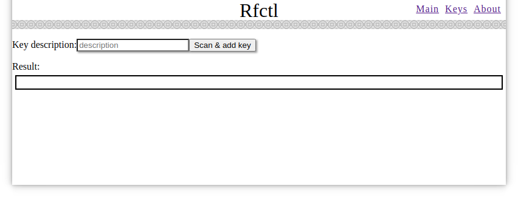

Web interface
=============
:warning: **Web interface is under construction.**

The main goal is build a simple and lightweight web server with **low memory usage footprint**. To run on a small SoC, like Orange Pi Zero or similar board.
One more idea is build **M2M (machine to machine) architecture**. So, you can use any programming platform to send HTTP request to server API (URL path: `/api/...`) and parse JSON answer.

Web server use build-in [bottle](https://www.bottlepy.org/) web framework and build-in [brython](https://brython.info/) client-side web programming language. So web server has pure python implementation on server and client sides.

To decrease HTML server load a part of executed code moved to the client side - to the browser. After page load a browser-side code running to generate content with AJAX requests to server API. For example: `def build_page_main` function in `rfctl_web_client.py` file.

HTML page can contain UI elements with one-time (after page load) AJAX request and time-based AJAX requests. See `def api_call` decorator for one-time request and `class ApiCallTimeRefresh` for time-based requests from `class Rfctl` in `rfctl_web_client.py` file.

Web server workflow:


Running web server
------------------

Run server (from `web` path):
```sh
python3 rfctl_web_server.py
```

Examples of web pages
---------------------

Main page:


Key list page:


Add key page:



About page:


